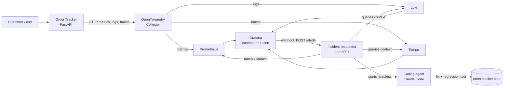

# Observability and Automated Incident Response

A mini-project where I took a small order tracking service with no visibility into its behavior and gave it the full set of production feedback loops: OpenTelemetry instrumentation, a telemetry pipeline with storage and dashboards, an alert on server errors, and an automated responder that hands each incident to a coding agent, which investigates and fixes the bug.

Everything runs locally with Docker Compose. The code is in [`order-tracker/`](order-tracker/).

## The problem

Picture a customer saying they can't open one of their orders. I check the website and everything looks fine: the page loads, my own test orders open, the health check passes. Nothing in the app tells me what happened to that customer's request.

That's the gap observability fills. With the right signals, I can answer "what went wrong for this request?" from data the system already recorded, instead of trying to reproduce the problem. Once the signals exist, I can also stop waiting for customers to report problems: an alert can notice the errors, and an automated responder can start investigating before anyone is paged.

## The application

[Order Tracker](order-tracker/) is a small FastAPI service backed by SQLite, with a web page and a JSON API:

| Method | Path | Purpose |
| --- | --- | --- |
| GET | `/api/orders` | List orders |
| POST | `/api/orders` | Create an order |
| GET | `/api/orders/{id}` | Look up an order |
| PATCH | `/api/orders/{id}` | Change an order's status |
| GET | `/healthz` | Health check |

On first start it seeds three orders: `standard-1001`, `express-1002`, and `standard-1003`. Express orders get an estimated delivery date two days after they're placed. `express-1002` is dated the last day of the previous month, and that detail turns out to matter.

## Architecture



## 1. Instrumenting the app with OpenTelemetry

Observability usually rests on three kinds of signals. Each answers a different question:

- **Metrics** are numbers aggregated over time: how many requests, how many failed, how long they took. They're cheap to store and quick to query, so they're what dashboards and alerts are built on. They show that something is wrong, but not why.
- **Logs** are timestamped records of individual events, like "order not found" or a stack trace. They give the details of a specific failure.
- **Traces** follow one request through the system as a tree of **spans**, one per unit of work, each with timing, attributes, and errors. A trace shows where in the request path things went wrong.

The signals are most useful when they're connected. Every log line written during a request carries that request's **trace ID**, so I can jump from an error log to the exact trace, and from a slow span to the logs it produced.

[OpenTelemetry](https://opentelemetry.io/) (OTel) is the vendor-neutral standard for producing all three. The app's setup lives in [`app/telemetry.py`](order-tracker/app/telemetry.py) and uses the OTel Python SDK directly:

- **A request counter**, `http.server.requests`, recorded by middleware for every request. Each count carries the HTTP method, the **route**, and the **HTTP response status code**. The route is the template (`/api/orders/{order_id}`), not the raw URL (`/api/orders/standard-1001`). Every distinct attribute combination becomes its own time series, so raw URLs would create one series per order ID and blow up the metrics store. This problem is called *high cardinality*.
- **An `order.lookup` span** around the database lookup, with `order.id`, `order.found`, and `order.priority` attributes. Unexpected exceptions are recorded on the span and mark it as an error. A missing order is a normal 404, so it isn't marked as an error.
- **Structured logs** for lookups: `INFO Order lookup succeeded`, `WARNING Order not found`, and `ERROR Order lookup failed` with the full stack trace. A small logging handler forwards Python's standard logging to OTel, so every record automatically carries the active trace and span IDs.

FastAPI 0.142 also has built-in OpenTelemetry support. Once an OTel provider is configured, it creates a server span for every request (`GET /api/orders/{order_id}`) and records an `http.server.request.duration` histogram. My `order.lookup` span nests under FastAPI's server span, so each trace shows the whole request.

### Console first

Before building any storage, I exported all three signals to stdout and read them with `docker compose logs app`. Looking up an order that exists:

```bash
curl -i http://localhost:8000/api/orders/standard-1001
```

produces a metric data point like this in the app's output:

```json
"name": "http.server.requests",
...
"attributes": {
    "http.request.method": "GET",
    "http.route": "/api/orders/{order_id}",
    "http.response.status_code": 200
},
"value": 1
```

The lookup succeeded, so the metric recorded status **200**. A span and an `INFO Order lookup succeeded` log record with the same trace ID appear next to it.

Console output is good for confirming that instrumentation works. It isn't something I could search, chart, or alert on, which is what the next step adds.

## 2. Building the telemetry pipeline

To store and query the signals, I added five services to [`compose.yaml`](order-tracker/compose.yaml), each configured from [`observability/`](order-tracker/observability/):

| Service | Role | Local URL |
| --- | --- | --- |
| [OpenTelemetry Collector](https://opentelemetry.io/docs/collector/) | Receives OTLP from the app and routes each signal to its store | internal only |
| [Prometheus](https://prometheus.io/) | Metrics storage, queried with PromQL | http://localhost:9090 |
| [Loki](https://grafana.com/oss/loki/) | Log storage, queried with LogQL | http://localhost:3100 |
| [Tempo](https://grafana.com/oss/tempo/) | Trace storage, queried with TraceQL | http://localhost:3200 |
| [Grafana](https://grafana.com/oss/grafana/) | Dashboards, exploration, and alerting over all three | http://localhost:3000 |

The app only knows about the Collector. It sends everything over OTLP to `otel-collector:4318`, and the Collector forwards metrics to Prometheus's native OTLP endpoint, logs to Loki's OTLP endpoint, and traces to Tempo. This decoupling is the main reason to use a Collector: I can change backends, add processing, or send data to more destinations without touching the application. When `OTEL_EXPORTER_OTLP_ENDPOINT` isn't set (for example when running `uvicorn` directly), the app falls back to console output.

A few details I had to get right along the way:

- **Metric names change on the way into Prometheus.** `http.server.requests` becomes `http_server_requests_total`, and attributes become labels like `http_route` and `http_response_status_code`.
- **New counters need a starting zero.** When a counter first appears with the value 1, Prometheus never sees it go up from 0, so `rate()` and `increase()` report nothing. That's a problem when the first 500 is exactly what I want to see. Prometheus's `created-timestamp-zero-ingestion` feature writes a 0 at each counter's start time, so the first request counts.
- **Exporting twice.** FastAPI's built-in telemetry adds its own OTLP exporters when it sees `OTEL_EXPORTER_OTLP_ENDPOINT`. With my exporters also configured, every span and log went to the Collector twice. Passing `telemetry={"auto_configure": False}` to `FastAPI()` fixed it.
- **Logs that link to traces.** Loki stores OTel log attributes, including `trace_id`, as *structured metadata*. Grafana's Loki data source turns that field into a "View trace" link to Tempo. The Tempo data source has the reverse "Related logs" link, which runs a Loki query for the span's trace ID.
- **Tempo search lags slightly.** Tempo 3 leaves the most recent 30 seconds out of search results, so a brand-new trace takes a moment to appear in searches. Fetching a trace by ID works right away.

### The dashboard

Grafana loads its data sources and an **Order Tracker** dashboard from files (*provisioning*), so the whole setup is in the repository and rebuilds the same way every time. The dashboard has:

- Stats for total requests, client errors (4xx), server errors (5xx), and the server error ratio
- Request rate and error rate over time, by route and status code
- A table of request counts per method, route, and status code, with status codes colored by class
- The app's logs from Loki
- Recent `order.lookup` traces from Tempo, with each order's ID and whether it was found

Health check traffic is filtered out of the request panels so Docker's 5-second health checks don't drown out real requests.

### Following one request through all three signals

Looking up an order that doesn't exist:

```bash
curl -i http://localhost:8000/api/orders/standard-1002
```

returns `404 Not Found`, and the request shows up in all three stores:

- **Metric:** the counts table shows `GET /api/orders/{order_id}` with status **404**, and the 4xx stat goes up by one.
- **Log:** `WARNING Order not found` with `order_id = standard-1002`. Expanding the line shows a "View trace" link.
- **Trace:** the server span `GET /api/orders/{order_id}` with a 404 status, and a child `order.lookup` span with `order.found = false`. The span's "Related logs" link leads back to the warning.

The difference between a 404 and a 500 matters here. A 404 means the client asked for something that doesn't exist, and the service handled it correctly. A 5xx means the service itself failed. The two are tracked separately, and only the second one indicates a problem I need to fix.

## 3. Alerting on server errors

A dashboard only helps when someone is looking at it. An **alert rule** watches a query on a schedule and changes state when a condition is met, so the system can notify someone, or something, without waiting for a human to open Grafana.

The rule is provisioned from [`observability/grafana/provisioning/alerting/order-tracker-alerts.yaml`](order-tracker/observability/grafana/provisioning/alerting/order-tracker-alerts.yaml):

- **Query:** the number of 5xx responses per endpoint (method and route) over the last 5 minutes:
  ```promql
  sum by (http_request_method, http_route) (
    increase(http_server_requests_total{job="order-tracker", http_response_status_code=~"5.."}[5m])
  )
  ```
- **Condition:** fires when that number is above 0. Grafana evaluates it every 10 seconds with no pending period, so a single 500 fires the alert.
- **Context on every alert:** an `endpoint` label (for example `GET /api/orders/{order_id}`), a `time_window: 5m` annotation, a description with the approximate count, and links to the dashboard and its error-rate panel. The description gives a human, or an agent, the starting point for an investigation.
- **Periods with no 5xx responses:** until the first server error happens, there is no 5xx series at all, so the query returns nothing. By default Grafana would report that as *No data*. I configured no data to count as **Normal**, because having no server errors is the healthy state. Query failures still show as *Error*, so a broken query isn't mistaken for healthy.

Grafana alert rules move between a few states:

| State | Meaning |
| --- | --- |
| **Normal** | The condition isn't met |
| **Pending** | The condition is met, but not yet for the rule's pending period |
| **Firing** | The condition is met (for long enough) and notifications go out |
| **No data** | The query returned nothing, unless configured otherwise |
| **Error** | The query or evaluation failed |

Repeating the `standard-1002` lookup produces only 404s, so the alert stays **Normal**: client errors aren't server errors. Looking up `express-1002` returns a 500, and within about 20 seconds the alert switches to **Firing**. It returns to Normal once 5 minutes pass without new 5xx responses.

One Grafana quirk cost some time: provisioning files treat `$` as the start of an environment variable, so the usual template syntax, `{{ $labels.http_route }}`, gets mangled. Writing templates as `{{ .Labels.http_route }}` avoids the `$` entirely.

## 4. An automated incident responder

When an alert fires, an on-call engineer normally gathers context, finds the cause, fixes it if they can, and escalates to developers if they can't. I built a service that does the same with a coding agent: [`order-tracker/incident-response/`](order-tracker/incident-response/).

It's a small FastAPI app that runs on the host at port 8001. It runs outside Docker because the agent needs my Claude Code login and the repository. Grafana reaches it through a **webhook**: an HTTP POST with the alert as JSON, sent to `http://host.docker.internal:8001/alerts`.

For each firing alert, the responder:

1. **Saves the evidence** in `incidents/<time>-<alertname>/`, so the investigation starts from facts instead of a bare alert name:
   - `incident.md`: a readable summary of the alert, affected endpoint, time range, dashboard link, request counts, error logs, and failing traces
   - `alert.json`, `metrics.json` (Prometheus), `logs.json` (Loki, with stack traces and trace IDs), and `traces.json` (Tempo, with every span and exception event)

   The time range runs from the alert's `time_window` before it started up to now. If a backend can't be reached, the error is recorded in the file and the investigation continues.
2. **Starts the coding agent in headless mode** (`claude -p`) in the background, from the project directory, with the instructions in [`prompt.md`](order-tracker/incident-response/prompt.md). The agent should find the cause in the evidence, make the smallest safe fix with a regression test, run the test suite, and write a `report.md`, or escalate if the fix isn't clear or safe.
3. **Records the outcome** in `response.md` and `status.json`, logs the agent's final line, and serves the results at `GET /incidents` and `GET /incidents/{id}`.

### Guardrails

An unattended agent changing code needs limits:

- **Permissions:** the agent can read files, edit code, run `pytest`, query the local backends with `curl`, and inspect git history. Everything else is denied, because a headless run can't ask for permission. It never runs with permission checks turned off.
- **Humans ship:** the agent never commits, pushes, rebuilds, restarts containers, or touches data. Its changes stay in the working tree for me to review and deploy.
- **A fixed result line:** every answer ends with one machine-readable line: `RESULT: TEST`, `FIXED`, `ESCALATE`, or `NO_ACTION`, followed by one sentence.
- **No duplicate runs:** Grafana re-sends alerts that keep firing. If the same alert and endpoint arrive while an agent is still working, the responder saves the new context but doesn't start a second agent.

### A test alert

Before connecting Grafana, I tested the responder with a synthetic alert labeled `test: "true"`. The prompt tells the agent to acknowledge test alerts without investigating:

```bash
curl -X POST http://localhost:8001/alerts \
  -H 'Content-Type: application/json' \
  -d '{"alerts":[{"status":"firing","labels":{"alertname":"ResponderTest","test":"true"},"annotations":{"summary":"Test notification; no incident to fix"}}]}'
```

The agent finished in about 8 seconds, changed nothing, and replied:

> I received the test alert `ResponderTest`, which has the label `test: "true"`. It's a check of the alerting pipeline, not a real incident, so I didn't investigate, change any code or write a report.
>
> RESULT: TEST - Received the ResponderTest test alert and took no action.

The responder still collects context for test alerts, and that made one run more interesting. In an earlier test, a real 500 from a few minutes before fell inside the 15-minute window. The agent still treated the alert as a test, but added that the evidence showed a real 500 on `GET /api/orders/{order_id}`, with its trace ID, and that someone should look at it. A later test, after that error had aged out of the window, had nothing extra to report. The agent's answer depends on the evidence it's given, and its wording varies between runs, which is why the fixed `RESULT:` line matters for anything that parses it.

## 5. The full loop: from failing request to fix

With the pieces in place, the last step was to connect them. Grafana's *incident-responder* contact point and notification policy ([`incident-responder.yaml`](order-tracker/observability/grafana/provisioning/alerting/incident-responder.yaml)) send every alert to the responder's webhook. They group notifications by alert name and endpoint, wait 10 seconds before the first one, and repeat every 4 hours while the alert keeps firing.

Then I looked up the problem order:

```bash
curl -i http://localhost:8000/api/orders/express-1002
```

```
HTTP/1.1 500 Internal Server Error
```

From there it ran on its own:

| Time (UTC) | Event |
| --- | --- |
| 18:49:13 | `GET /api/orders/express-1002` returns 500 |
| 18:49:20 | The 5xx alert starts firing for `GET /api/orders/{order_id}` |
| 18:49:49 | Grafana's webhook reaches the responder; it saves the context and starts the agent |
| 18:50:35 | The agent finishes: `RESULT: FIXED` |

From the failing request to a tested fix took less than a minute and a half, and the agent run cost about $0.40.

### What the agent found

The evidence pointed straight at the cause. The `order.lookup` span in the failing trace had `order.found = true` and `order.priority = express`, and an exception event:

```
File "/app/app/main.py", line 61, in order_detail
    estimated_at = placed_at.replace(day=placed_at.day + 2)
ValueError: day is out of range for month
```

**The express delivery estimate tried to use a day that doesn't exist in that month.** The code added two days by changing the day number. Python's `datetime.replace()` doesn't roll over into the next month, so for an order placed on September 30 it asked for September 32 and raised `ValueError`. FastAPI turned the unhandled exception into a 500. `express-1002` was placed on the last day of the previous month, so it failed on every lookup. Standard orders don't get an estimate, so they were never affected. That's why everything looked fine when I tested with other orders.

The agent's incident report also worked out impact I hadn't asked about. On the last days of a month, `POST` and `PATCH` requests for express orders also return 500, even though the database change is saved. A client that retries a failed `POST` could create a duplicate order.

### The fix

A one-line change to date arithmetic that handles month and year boundaries:

```diff
-        estimated_at = placed_at.replace(day=placed_at.day + 2)
+        estimated_at = placed_at + timedelta(days=2)
```

The agent also added a regression test that inserts express orders placed on September 30, December 31, and February 27, and checks that the estimates roll over to October 2, January 2 of the next year, and March 1. It ran the suite before the fix (3 new cases failed) and after (all 6 passed).

### Verifying

The agent leaves deployment to a human, so I reviewed the diff, rebuilt, and repeated the request:

```bash
docker compose up --build -d --wait
curl -i http://localhost:8000/api/orders/express-1002
```

```
HTTP/1.1 200 OK
{"id":"express-1002","customer":"Sam","item":"Headphones","priority":"express","status":"preparing","created_at":"2026-09-30T17:19:42.546475+00:00","estimated_delivery":"2026-10-02"}
```

With no new 5xx responses, the alert returned to Normal.

## Takeaways

- **Instrument with the questions in mind.** Route templates and status codes on the request metric, order attributes on the span, and trace IDs on every log line made the failing request findable and explainable within seconds.
- **Keep apps decoupled from backends.** The app speaks OTLP to a Collector and knows nothing about Prometheus, Loki, or Tempo.
- **Check what the framework already does.** FastAPI's built-in telemetry was useful, but it also exported everything twice until I turned off its auto-configuration.
- **Design alerts for the quiet times too.** Deciding what *no data* means is part of the rule, not an afterthought.
- **An agent is only as good as its evidence.** Collecting metrics, logs with stack traces, and traces up front let the agent go from alert to root cause without guessing. Clear guardrails and a fixed result format made it safe to run unattended.
- **Humans stay in the loop.** The agent fixed and tested the code; I reviewed and deployed it.

## Running it

From [`order-tracker/`](order-tracker/):

```bash
docker compose up --build -d --wait
```

This starts the app on http://localhost:8000, Grafana on http://localhost:3000 (no login), and Prometheus, Loki, Tempo, and the Collector behind it.

In a separate terminal, start the responder. It needs `uv` and a logged-in `claude` CLI:

```bash
cd order-tracker/incident-response
uv run --frozen python responder.py
```

Run the tests:

```bash
cd order-tracker && uv run --frozen pytest -q
cd order-tracker/incident-response && uv run --frozen pytest -q
```

## Project layout

```
order-tracker/
├── app/
│   ├── main.py                  # FastAPI app, request metric middleware, order.lookup span
│   └── telemetry.py             # OpenTelemetry setup: OTLP or console exporters, log handler
├── tests/                       # App tests
├── compose.yaml                 # App + Collector, Prometheus, Loki, Tempo, Grafana
├── observability/
│   ├── otel-collector.yaml      # OTLP in; Prometheus, Loki, Tempo out
│   ├── prometheus.yaml
│   ├── loki.yaml
│   ├── tempo.yaml
│   └── grafana/
│       ├── dashboards/order-tracker.json
│       └── provisioning/
│           ├── datasources/     # Prometheus, Loki, Tempo with log ↔ trace links
│           ├── dashboards/
│           └── alerting/        # 5xx alert rule, webhook contact point and policy
└── incident-response/
    ├── responder.py             # POST /alerts: save context, start the agent
    ├── prompt.md                # Instructions for the headless agent
    └── tests/
```
